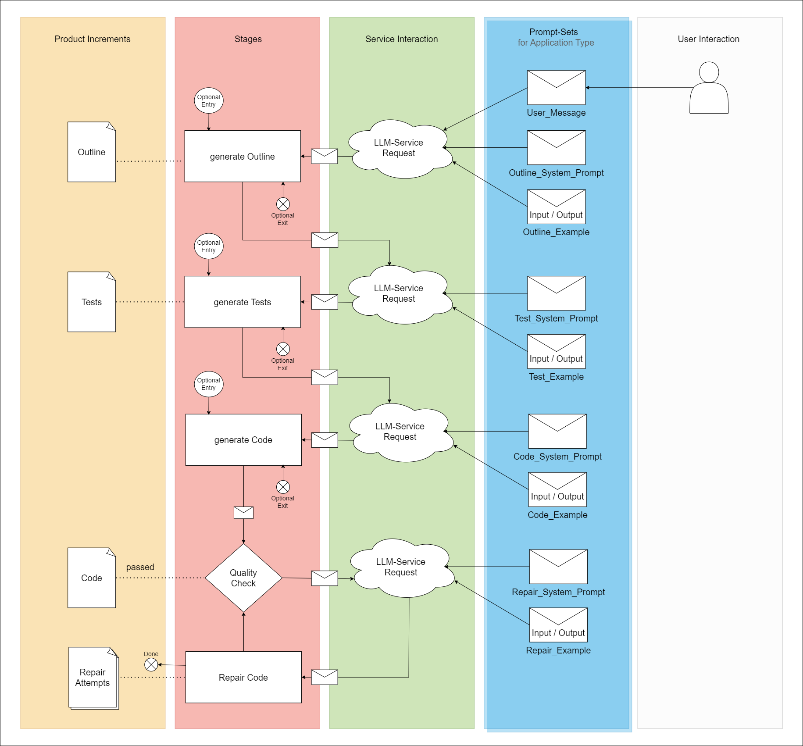

# TDD-LLM

Autonomous Software Development: A Pipeline for Test-Driven Development utilizing Large Language Models

## Description

This is an implementation of a LangChain-Pipeline aiming to improve Python-Code-Generation by simulating test-driven-development loops to generate a minimum-viable-product with no mandatory human intervention.

### Core-Algorithm
```
# prepare
connect to LLM-Service
get prompts (outline, test, code, repair)
get user_message

# outline
    generate outline from outline_prompt and user_message

# test
    generate test from test_prompt and outline

# code
    generate code from code_prompt and test

# verify quality
run linting_test on code
if linting_result == true
    exit(success)

# repair
while linting_result == false and attempts > 3
    generate repair from code
    advance attempts
    run linting_test on repair
    if linting_result == true 
        exit(success)
    if attempts == 4
        exit(failed)
```

### Architecture


### Pseudo-Code

```
# prepare
get style of prompt
get entry_point
get exit_point
connect to LLM-Service
get prompts (outline, test, code, repair)

# outline
if entry_point == "new"
    get user_message
    generate outline from outline_prompt and user_message
    save outline to file 
else if entry_point == "outline" 
    read outline from file
#exit at outline
if exit_point == outline
    exit

# test
if entry_point == "new" or entry_point == "outline"
    generate test from test_prompt and outline
    save test to file
else if entry_point == "test"
    read test from file
#exit at test
if exit_point == test
    exit

# code
if entry_point == "new" or entry_point == "outline" or entry_point == "test"
    generate code from code_prompt and test
    save code to file
else if entry_point == "code"
    read code from file    
if exit_point == code
    exit

# verify quality
run linting_test on code
if linting_result == true
    save code as success
    exit
else 
    save code as failed

#repair
while linting_result == false and attempts > 3
    generate repair from code
    save repair to file as repair_<attempt_number>.txt
    else print repair attempt failed
    advance attempts
    run linting_test on repair
    if linting_result == true 
        save code to file as success
if attempts == 4
    exit
```

## Getting Started

### Dependencies
* GPU with Cuda-Support
* Windows 10/11
* Llama-cpp-python (using Visual Studio C++-Compiler and CuBlas-Support)
* see requirements.txt (some files in the generatedfiles-folder may use unspecified libraries)

### Installing

Clone the Repository: You can clone the repository using Git by running the following command in your terminal or command prompt:

```bash
git clone https://github.com/aysey001/TDD-LLM.git
```
### Executing Program

* Modify the user_message.txt, insert custom prompt
* start llm inference server
```
\bin\server_7b.bat
```
* run simple_loop.py
```
python \src\simple_loop.py
```

## Current Features
* Entry/Exit at any stage
* Supply custom prompt at any Stage
* Select application type (currently supports Flask-Application and Console Application)


## Authors

Aydin Yusuf Seyhan


## Version History

* 0.2
    * Various bug fixes and optimizations
    * See [commit change]() or See [release history]()
* 0.1
    * Initial Release

## License

This project is licensed under the [NAME HERE] License - see the LICENSE.md file for details

## Acknowledgments
Inspiration, code snippets, etc.
